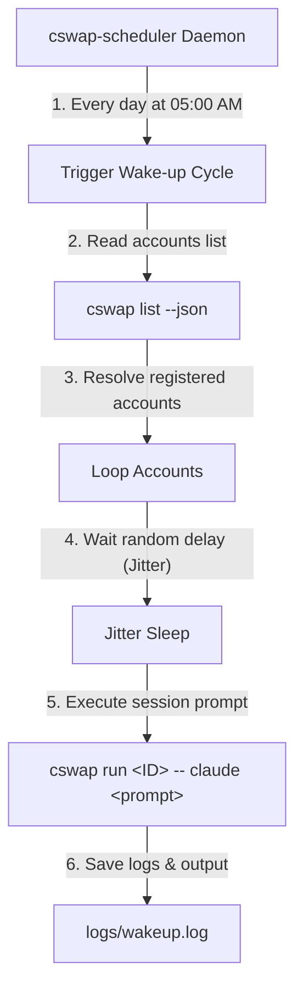

<h1 align="center">cswap-scheduler ⏰</h1>

<p align="center">
  <strong>An automatic multi-account scheduler and session wake-up daemon for Claude Code CLI.</strong>
</p>

<p align="center">
  <a href="https://github.com/realiti4/claude-swap"></a>
  <a href="https://python.org"></a>
  
  
</p>

---

## Overview

`cswap-scheduler` is a lightweight Python daemon that automates the early-morning "wake up" check for multiple **Claude Code CLI** accounts. 

### Why do I need this?
Claude Code subscription limits reset periodically (e.g., rolling 5-hour windows). If you use Claude Code heavily, your quota might be locked. By sending a tiny non-interactive wake-up prompt to all accounts early in the morning (e.g., 5:00 AM), you trigger the rolling window calculation, ensuring that by the time you start your work day (e.g., 10:00 AM), your usage limits have reset and you have a **100% fresh quota** across all accounts.

It integrates seamlessly with the **[`claude-swap`](https://github.com/realiti4/claude-swap)** CLI tool (`cswap`) to isolate configurations and run concurrent sessions without modifying your active console environment.

---

## How It Works (Architecture)

The scheduler queries the local `cswap` accounts database, maps scheduled tasks, and runs non-interactive greetings sequentially with randomized delays (jitter) to prevent simultaneous rate-limit triggers.



---

## Table of Contents
1. [Prerequisites](#prerequisites)
2. [Installation & Getting Started](#installation--getting-started)
3. [Configuration Reference](#configuration-reference)
4. [Usage Guides](#usage-guides)
   - [Manual Test Run](#manual-test-run)
   - [Production Daemon Run](#production-daemon-run)
5. [Troubleshooting & Logs](#troubleshooting--logs)
6. [License](#license)

---

## Prerequisites

*   **Python 3.8+**
*   **Claude Code CLI** (`@anthropic-ai/claude-code` installed on your machine)
*   **`claude-swap` CLI tool** (`cswap`)

> [!NOTE]
> If you don't have `claude-swap` installed, you can install it globally via `uv` or `pipx`:
> ```bash
> uv tool install claude-swap
> # OR
> pipx install claude-swap
> ```

---

## Installation & Getting Started

### Step 1: Clone the Repository
Clone this repository to your local machine or server:
```bash
git clone https://github.com/your-username/claude-code-scheduler.git
cd claude-code-scheduler
```

### Step 2: Register Accounts in cswap
Register all your target Claude Code accounts into `cswap` (if not already done):
1.  Log into your first account via standard Claude CLI:
    ```bash
    claude
    ```
2.  Save it to `cswap`:
    ```bash
    cswap add
    ```
3.  Repeat for any additional accounts (use `claude logout` followed by `claude` to switch accounts before adding them).
4.  Confirm the accounts are tracked:
    ```bash
    cswap list
    ```

### Step 3: Initialize Configuration
Copy the template configuration file:
```bash
cp config.json.example config.json
```
Customize the configuration parameters in `config.json` (see the [Configuration Reference](#configuration-reference) section below).

### Step 4: Install Python Dependencies
Create a virtual environment and install the required packages:
```bash
python3 -m venv venv
venv/bin/pip install -r requirements.txt
```

---

## Configuration Reference

The `config.json` parameters allow you to customize scheduling time, prompt text, and randomized delays:

| Parameter | Type | Default Value | Description |
| :--- | :--- | :--- | :--- |
| `schedule_time` | `string` | `"05:00"` | The daily trigger time in `HH:MM` format (local time). |
| `wake_up_prompt` | `string` | `"Hello Claude, wake up check. Please reply with 'OK' only."` | The non-interactive prompt sent to Claude Code to initiate the session without triggering command execution prompts. |
| `jitter_min` | `integer` | `30` | Minimum sleep delay (seconds) between processing different accounts. |
| `jitter_max` | `integer` | `120` | Maximum sleep delay (seconds) between processing different accounts. |

> [!IMPORTANT]
> The `wake_up_prompt` is designed to be conversational and short. Do not include prompts requesting shell command executions or file modifications, as Claude Code will hang waiting for manual approval.

---

## Usage Guides

### Manual Test Run
Run the script with the `--now` flag to trigger a wake-up cycle immediately. This is useful for verifying your credentials and logs:
```bash
venv/bin/python scheduler.py --now
```

### Production Daemon Run
To run the scheduler continuously in the background 24/7, use `nohup`:
```bash
nohup venv/bin/python scheduler.py > logs/system.log 2>&1 &
```

### Manage the Background Process
To check if the background daemon is currently active:
```bash
ps aux | grep scheduler.py
```
To stop the daemon, terminate the process:
```bash
kill <PID>
```
*(Replace `<PID>` with the process ID returned from the `ps` command).*

---

## Troubleshooting & Logs

All logging outputs are structured and written to the `logs` folder:
*   **`logs/wakeup.log`**: Contains the execution history of daily pings, including timestamps, successes, and response previews from Claude.
*   **`logs/system.log`**: Captures stdout/stderr redirects and standard Python traceback logs if the daemon crashes.

If a wake-up task fails for an account:
1.  Check if you can run the session manually:
    ```bash
    cswap run <ID>
    ```
2.  If the token has expired or is invalid, re-log in:
    ```bash
    cswap run <ID> -- claude auth login
    ```

---

## License

This project is licensed under the [MIT License](LICENSE).
